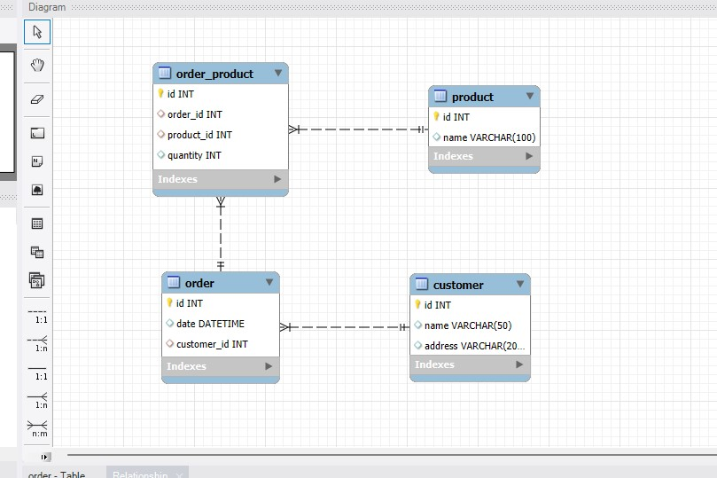

# goit-rdb-hw-02

# Початкова таблиця

| Номер_замовлення | Назва_товару і кількість | Адреса_кліента | Дата_замовлення  | Кліент  |
|---------|--------------------------------|------------------|--------------|-----------|
| 101     | Laptop: 3, Mouse: 2           | Khreshchatyk 1   | 2023-03-15   | Melnyk    |
| 102     | Printer: 1                    | Baseyna 2        | 2023-03-16   | Shevchenko|
| 103     | Mouse: 4                      | Kompyuterna 3    | 2023-03-17   | Kovalenko |

1. Переведіть початкову таблицю в першу нормальну форму.

2. Переведіть нові таблиці в другу нормальну форму.

3. Переведіть нові таблиці в третю нормальну форму.

4. Розробіть ER-діаграму отриманих таблиць.

5. Використовуючи ER-діаграму, створіть таблиці в базі даних.

 